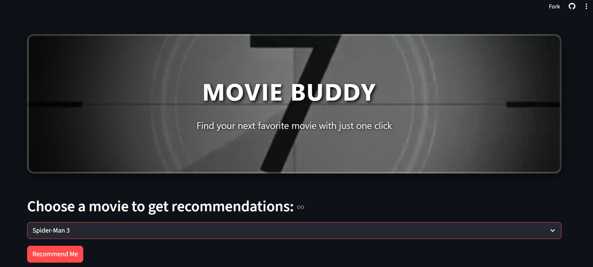
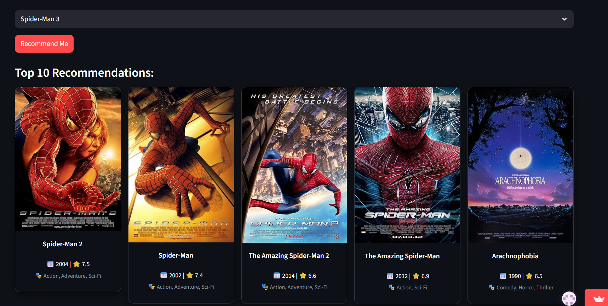

# 🎬 Movie Buddy


> **Your personal movie matchmaker!**  
> Pick a movie you already love, and Movie Buddy will find other movies with **similar plots, genres, cast, and crew** — like a cinematic soulmate search. 💖🍿  

---

## ✨ Features

- **🎯 Intuitive Interface** – Clean and minimal **Streamlit** UI for effortless browsing.  
- **📚 Vast Movie Selection** – Database of **5,000+ movies** to explore.  
- **🧠 Smart Recommendations** – Content-based filtering using **ML algorithms**.  
- **🖼️ Visual Feedback** – Movie posters, release years, and ratings fetched in real time from **OMDb API**.  

---

## 🛠 Tech Stack

| Layer                | Technologies |
|----------------------|--------------|
| **Backend**          | Python |
| **Frontend**         | Streamlit |
| **Data Manipulation**| Pandas, NumPy |
| **Machine Learning** | Scikit-learn (CountVectorizer, cosine_similarity) |
| **API**              | OMDb API |
| **Deployment**       | Streamlit Community Cloud & GitHub LFS |

---

## 🚀 Getting Started

Follow these steps to run Movie Buddy locally:

```bash
# 1️⃣ Clone the repository
git clone https://github.com/your-username/your-repo-name.git

# 2️⃣ Navigate to the project folder
cd your-repo-name

# 3️⃣ Install dependencies
pip install -r requirements.txt

# 4️⃣ Run the app
streamlit run app.py
```
## 📸 Preview

Here’s a sneak peek at **Movie Buddy** in action:  

| Home Page | Recommendations |
|-----------|-----------------|
|  |  |


## 📂 Project Structure

```plaintext
movie-buddy/
│
├── app.py              # Main Streamlit application
├── requirements.txt    # Required Python packages
├── movie_dict.pkl      # Saved movie data for the app
├── similarity.pkl      # Saved similarity matrix model
└── README.md           # Project documentation
```

## 👤 Author
Amisha
💌 Passionate about data, design, and delivering delightful movie experiences.


## ⭐ Show Some Love
If you like this project, please ⭐ it on GitHub and share it with your movie-loving friends!


## 📜 License
This project is licensed under the MIT License.
Feel free to fork, modify, and build upon it. 🎬


